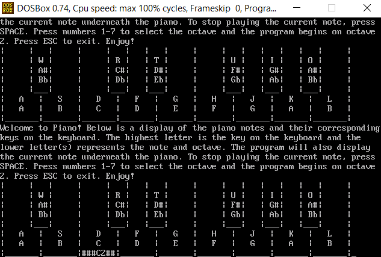
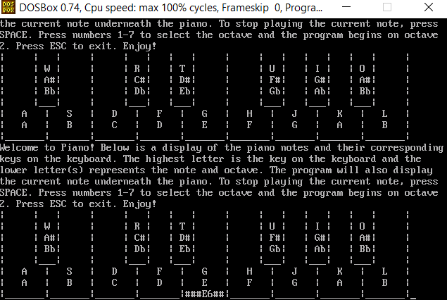

# Final_C_Project

# Project PIANO

by Julia Toscano and Jackson Wilds

for CS 102 Section C Fall 2021

 

## Introduction

The piano program displays a piano graphic which highlights the current note being played and plays a sound of the corresponding frequency based on user keyboard input. The program also changes octaves when the user presses a number. Included is a makefile that does not actually do anything, but is included to demonstrate that we know how to make one anyway and to match the formatting. Also included in a prj file which is how the files are linked in Turbo C++. More details on this in the included tutorial video.

 

## Technical Description

This is all done with a switch statement that changes the value of the current frequency, the keyboard graphic, or octave based on letter or number keys pressed. The sound is played with the sound() function from the DOS library. The program also contains two if statements, one to close the program when the user presses ESC and one to silence the piano when the user presses SPACE. All these are contained inside in infinite while loop. The user input is obtained via getch() within a if statement stating that getch() should only be performed when the user presses a key via the kbhit() function from the conio library.

 

## Screen Shots of Working Program

 

 

## Link to YouTube video recording of presentation and code walk through.

code walkthrough: https://youtu.be/ZELy-s4Rato

running code tutorial: https://youtu.be/tqlrqZg135o
